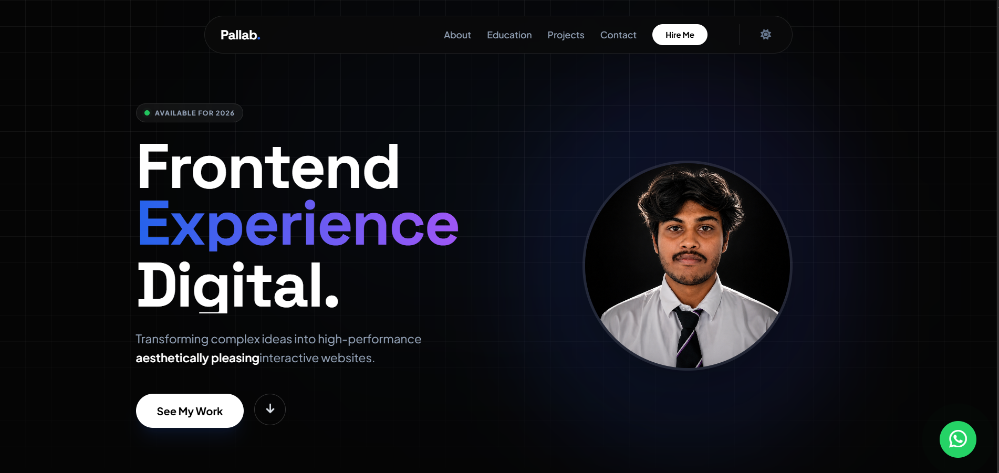

# 🚀 Pallab — Creative Full-Stack Developer Portfolio

<div align="center">



### Modern • Interactive • Responsive • Performance-Focused

A modern personal portfolio website built to showcase my **full-stack development skills, projects, experience, and creative digital work**.

[🌐 Live Demo](https://silver-pothos-bdbfe5.netlify.app/) • [💻 GitHub Repository](https://github.com/PALLAB2005/PALLAB-PORTFOLIO)

</div>

---

## 👋 About

Welcome to my personal developer portfolio.

This website is designed to present my **development journey, technical skills, projects, experience, and creative work** through a modern and interactive interface.

The portfolio focuses on combining **clean design, smooth animations, responsive layouts, and engaging user interactions** to create a professional digital experience.

### What you'll find

* 👨‍💻 Full-Stack Development
* 🎨 Frontend Development
* 🖌️ UI/UX & Creative Design
* 🚀 Personal & Client Projects
* 💼 Experience & Education
* 🛠️ Technical Skills
* 📬 Contact & Social Profiles

---

## ✨ Highlights

| Feature                | Description                                          |
| ---------------------- | ---------------------------------------------------- |
| 🌓 Dark / Light Mode   | Switch between dark and light themes                 |
| ⚡ Preloader            | Animated loading experience                          |
| 🎯 ScrollSpy           | Navigation automatically follows the current section |
| 🧲 Magnetic Buttons    | Interactive cursor-based button movement             |
| 💡 Spotlight Cards     | Dynamic spotlight hover effects                      |
| 🌀 3D Tilt Cards       | Interactive project card animations                  |
| 🖼️ Parallax Images    | Smooth image movement while scrolling                |
| 📂 Project Filtering   | Filter projects by category                          |
| 🪟 Project Modal       | View project details without leaving the page        |
| 🔔 Toast Notifications | Interactive notification messages                    |
| 👁️ Scroll Reveal      | Elements animate into view while scrolling           |
| 📱 Responsive          | Optimized for desktop, tablet, and mobile            |

---

# 🌟 Features

## 🎨 Modern UI & Design

* Clean and modern portfolio interface
* Dark / Light theme
* Smooth scrolling
* Responsive layouts
* Modern typography
* Interactive hover states
* Glassmorphism-inspired components
* Consistent spacing and visual hierarchy
* Mobile-friendly navigation

---

## ⚡ Interactive Experience

The website includes several interactive effects designed to make the browsing experience more engaging.

### 🧲 Magnetic Buttons

Buttons respond dynamically to cursor movement for a more interactive feel.

### 💡 Spotlight Cards

Project and content cards use spotlight hover effects to create depth and focus.

### 🌀 3D Tilt Effects

Project cards respond to cursor movement with a subtle 3D perspective effect.

### 🖼️ Parallax Effects

Images move at different speeds during scrolling to create a layered visual experience.

### 👁️ Scroll Reveal

Sections and components smoothly appear as they enter the viewport using the **Intersection Observer API**.

---

# 📂 Project Showcase

The portfolio includes an interactive project showcase with:

* Project categories
* Project filtering
* Technology tags
* Project cards
* Project preview modal
* Responsive project gallery
* Interactive hover effects

Projects can be explored directly from the portfolio interface.

---

# 🌓 Theme System

The portfolio supports both:

* ☀️ Light Mode
* 🌙 Dark Mode

The selected theme is stored using **LocalStorage**, allowing the user's preference to persist between visits.

---

# 🛠️ Tech Stack

## Frontend

| Technology       | Purpose                                |
| ---------------- | -------------------------------------- |
| **HTML5**        | Semantic website structure             |
| **CSS3**         | Styling, layout & animations           |
| **JavaScript**   | Interactions and dynamic functionality |
| **Tailwind CSS** | Utility-based styling                  |
| **Font Awesome** | Icons                                  |
| **Google Fonts** | Typography                             |

## Development Tools

* Git
* GitHub
* Visual Studio Code
* Netlify
* Chrome DevTools

---

# 📁 Project Structure

```text
PALLAB-PORTFOLIO/
│
├── 📄 index.html
├── 📄 styles.css
├── 📄 script.js
├── 📄 README.md
│
└── 📁 images/
    ├── 🖼️ Demo.png
    ├── 🖼️ photo1.png
    ├── 🖼️ photo2.png
    ├── 🖼️ Cleveroad.jpg
    ├── 🖼️ Game Dashboard Design.jpg
    ├── 🖼️ Task manager app.jpg
    └── 🖼️ ...
```

---

# 🚀 Getting Started

Follow the steps below to run the portfolio locally.

## 1️⃣ Clone the Repository

```bash
git clone https://github.com/PALLAB2005/PALLAB-PORTFOLIO.git
```

---

## 2️⃣ Navigate to the Project

```bash
cd PALLAB-PORTFOLIO
```

---

## 3️⃣ Open the Website

You can open the project directly by opening:

```text
index.html
```

in your browser.

### Recommended

If you use **VS Code**, install the **Live Server** extension.

Then:

```text
Right Click → Open with Live Server
```

The website will open automatically in your browser.

---

# 🎨 Customization

You can easily customize the portfolio according to your personal brand.

## 👤 Personal Information

Open:

```text
index.html
```

Update:

* Name
* Introduction
* About section
* Skills
* Education
* Experience
* Projects
* Contact information
* Social media links

---

## 🎨 Styling

Edit:

```text
styles.css
```

You can customize:

* Colors
* Fonts
* Typography
* Spacing
* Animations
* Cards
* Buttons
* Responsive layouts
* Background effects

---

## ⚙️ JavaScript

Edit:

```text
script.js
```

You can modify:

* Theme switching
* Navigation
* ScrollSpy
* Project filtering
* Project modal
* Toast notifications
* Magnetic buttons
* 3D tilt effects
* Parallax effects
* Scroll animations

---

# 📸 Preview

<div align="center">


</div>

---

# 🌐 Live Website

<div align="center">

### 🚀 Explore the Portfolio

[**Visit Live Portfolio →**](https://silver-pothos-bdbfe5.netlify.app/)

</div>

---

# 📱 Responsive Design

The portfolio has been designed to provide a consistent experience across different screen sizes.

### Supported Devices

* 💻 Desktop
* 🖥️ Large Screens
* 💻 Laptop
* 📱 Tablet
* 📱 Mobile

The layout automatically adapts to different viewport sizes.

---

# ⚡ Performance & User Experience

Performance and usability are important parts of this project.

The portfolio uses:

* Lightweight Vanilla JavaScript
* CSS-based animations
* Intersection Observer API
* LocalStorage
* Responsive layouts
* Optimized DOM interactions
* Minimal external dependencies
* Smooth scrolling
* Efficient event handling

The goal is to maintain a balance between **visual effects and website performance**.

---

# 🔍 SEO & Accessibility

The project can be further optimized for:

* Semantic HTML
* SEO metadata
* Accessible navigation
* Keyboard navigation
* Image `alt` attributes
* Responsive typography
* Proper heading hierarchy

---

# 🚀 Deployment

The portfolio can be deployed using platforms such as:

* Netlify
* GitHub Pages
* Vercel
* Cloudflare Pages

### Netlify Deployment

1. Push the project to GitHub.
2. Open Netlify.
3. Select **Add new project**.
4. Connect your GitHub repository.
5. Select `PALLAB-PORTFOLIO`.
6. Deploy the project.

Because this is a static website, no backend server is required for the current version.

---

# 🔄 Updating the Website

After making changes locally:

```bash
git add .
```

Commit your changes:

```bash
git commit -m "Update portfolio"
```

Push to GitHub:

```bash
git push origin main
```

If your Netlify project is connected to GitHub, the website can automatically redeploy after the push.

---

# 🔮 Future Improvements

The project is continuously evolving.

Planned improvements include:

* [ ] Add functional backend contact form
* [ ] Add downloadable resume
* [ ] Add GitHub API integration
* [ ] Add GitHub contribution/activity section
* [ ] Add blog section
* [ ] Add project CMS
* [ ] Add advanced page transitions
* [ ] Add more 3D interactions
* [ ] Improve accessibility
* [ ] Improve SEO
* [ ] Add analytics
* [ ] Add multilingual support
* [ ] Add additional performance optimizations

---

# 🤝 Contributing

This is primarily a personal portfolio project, but suggestions and improvements are welcome.

### Fork the Repository

```bash
git clone https://github.com/PALLAB2005/PALLAB-PORTFOLIO.git
```

Create a new branch:

```bash
git checkout -b feature/improvement
```

Make your changes and commit:

```bash
git add .
git commit -m "Add portfolio improvement"
```

Push your branch:

```bash
git push origin feature/improvement
```

Then create a **Pull Request**.

---

# 📬 Contact

<div align="center">

### 👨‍💻 Pallab Bag

**Full-Stack Developer • Frontend Developer • UI/UX Enthusiast**

I enjoy building modern websites, interactive interfaces, and useful digital products.

<br>

🐙 **GitHub**

[**PALLAB2005**](https://github.com/PALLAB2005)

<br>

💼 **LinkedIn**

[**Connect with me on LinkedIn**](https://www.linkedin.com/)

<br>

📧 **Email**

`your-email@example.com`

</div>

---

# ⭐ Support

If you found this project useful or liked the design, consider giving the repository a ⭐.

Your support helps motivate me to keep learning, building, and creating better digital experiences.

---

<div align="center">

## 🚀 Built with passion, creativity & code.

### Made with ❤️ by **Pallab Bag**

**© 2026 Pallab Bag. All Rights Reserved.**

</div>
